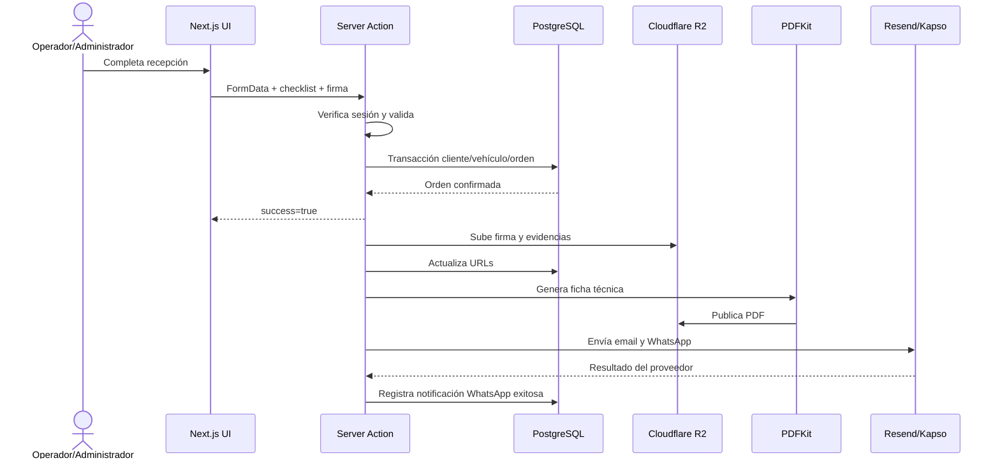

# Casa Tuning — Arquitectura y stack tecnológico

## 1. Propósito del documento

Este documento define la arquitectura vigente de **Casa Tuning**, sus límites técnicos y las decisiones que deben respetar futuros desarrollos.

La fuente de verdad de este análisis es el repositorio auditado el **4 de septiembre de 2026**. Cuando una práctica todavía no existe en el código, se identifica como **estado objetivo** y no como capacidad disponible.

## 2. Resumen ejecutivo

Casa Tuning es una aplicación web para gestionar el ciclo operativo de un taller de personalización y servicios automotrices:

1. Agenda una reserva.
2. Registra al cliente y su vehículo.
3. Crea la recepción sin exigir número de documento.
4. Captura servicios, inspección visual, evidencias y firma.
5. Sigue la orden durante el trabajo.
6. Genera una ficha técnica PDF.
7. Notifica al cliente por WhatsApp y correo.
8. Conserva historial y habilita campañas segmentadas.

La solución está implementada como un **monolito modular full stack** sobre Next.js App Router. La interfaz, las acciones de aplicación y los controladores HTTP conviven en un mismo despliegue; PostgreSQL conserva el estado transaccional y Cloudflare R2 almacena archivos.

## 3. Estado de la plataforma

| Marca | Significado |
|---|---|
| Implementado | Existe y se usa en el repositorio actual. |
| Parcial | Existe, pero presenta una brecha de contrato, seguridad u operación. |
| Objetivo | Directriz para la siguiente evolución; aún no debe venderse como implementada. |

| Capacidad | Estado | Evidencia principal |
|---|---|---|
| Aplicación web responsive | Implementado | Next.js App Router y componentes React. |
| Autenticación por credenciales | Implementado | Auth.js/NextAuth con JWT y proveedor Credentials. |
| Roles Administrador y Operador | Implementado | Tablas `roles`/`users` y validadores de sesión. |
| Reservas y recordatorios | Implementado | Módulo `/reservas` y cron de recordatorios. |
| Recepción sin documento obligatorio | Implementado | El tipo y número de documento son opcionales. |
| Seguimiento de órdenes | Implementado | Estados, actividad, comentarios, firma y PDFs. |
| WhatsApp y correo | Implementado | Kapso/Meta Cloud API y Resend. |
| Campañas segmentadas | Implementado | Promociones por marca, servicio y clientes seleccionados. |
| Almacenamiento de archivos | Implementado | API S3-compatible de Cloudflare R2. |
| Docker/Compose versionado | No implementado | No existen `Dockerfile` ni archivos Compose. |
| Suite automatizada de pruebas | No implementado | No hay runner ni scripts de test configurados. |
| API pública versionada | No implementado | Las operaciones usan Server Actions internas. |
| Multiempresa/multitenancy | No implementado | Las entidades no tienen `tenantId` ni aislamiento por organización. |

## 4. Stack exacto auditado

### 4.1 Runtime y aplicación

| Tecnología | Versión declarada | Responsabilidad |
|---|---:|---|
| Node.js | Sin `engines`; entorno auditado `v24.19.0` | Runtime del servidor y herramientas. |
| npm | Lockfile v3; entorno auditado `11.17.0` | Instalación reproducible con `npm ci`. |
| Next.js | `16.2.7` | App Router, Server Components, Server Actions, Route Handlers y compilación. |
| React / React DOM | `19.2.4` | Interfaz y estado local del navegador. |
| TypeScript | `^5` | Tipado estricto; `strict: true`, `noEmit: true`. |
| Tailwind CSS | `^4` | Sistema de estilos mediante PostCSS. |
| Lucide React | `^1.17.0` | Iconografía. |
| class-variance-authority | `^0.7.1` | Variantes de componentes. |
| clsx | `^2.1.1` | Composición condicional de clases. |
| tailwind-merge | `^3.6.0` | Resolución de conflictos de utilidades Tailwind. |

### 4.2 Identidad, datos y seguridad

| Tecnología | Versión declarada | Responsabilidad |
|---|---:|---|
| Auth.js / NextAuth | `^5.0.0-beta.31` | Sesión JWT y autenticación por credenciales. |
| bcryptjs | `^3.0.3` | Hash de contraseñas con coste 10. |
| Zod | Transitiva en el lockfile | Validación de credenciales en autenticación. No es dependencia directa. |
| PostgreSQL | Versión de servidor no fijada | Base relacional principal. |
| Prisma ORM / Client | `^7.8.0` | Modelo, migraciones y acceso tipado a datos. |
| `@prisma/adapter-pg` | `^7.8.0` | Adaptador Prisma sobre el driver `pg`. |
| `pg` | `^8.21.0` | Pool de conexiones PostgreSQL. |
| Node `crypto` | Runtime | AES-256-CBC para documento y SHA-256 como índice ciego. |

### 4.3 Documentos, archivos y comunicaciones

| Tecnología | Versión declarada | Responsabilidad |
|---|---:|---|
| Cloudflare R2 | Servicio externo | Objetos públicos: firmas, evidencias, logos, campañas y PDFs. |
| AWS SDK S3 | `^3.1069.0` | Cliente compatible con R2. |
| S3 Request Presigner | `^3.1073.0` | URLs temporales de subida directa. |
| PDFKit | `^0.19.1` | Generación de ficha técnica en PDF. |
| Resend | `^6.12.4` | Correos transaccionales e idempotencia de envío. |
| Kapso + Meta WhatsApp Cloud API | API `v24.0` | Plantillas, mensajes y campañas de WhatsApp. |

### 4.4 Configuración y herramientas de desarrollo

| Tecnología | Versión declarada | Responsabilidad |
|---|---:|---|
| dotenv | `^17.4.2` | Carga de `.env` para la configuración de Prisma. |
| ESLint | `^9` | Análisis estático. |
| eslint-config-next | `16.2.7` | Reglas alineadas con Next.js. |
| PostCSS para Tailwind | `@tailwindcss/postcss ^4` | Transformación de estilos. |
| tsx | `^4.22.4` | Ejecución TypeScript del seed de Prisma. |
| Tipos de Node | `^20` | Definiciones de desarrollo; no fija la versión del runtime. |
| Tipos de React / React DOM | `^19` | Definiciones de desarrollo. |

### 4.5 Composición de lenguajes

La captura de GitHub proporcionada reporta:

| Lenguaje | Proporción |
|---|---:|
| TypeScript | 90,4 % |
| JavaScript | 5,1 % |
| HTML | 4,2 % |
| Otros | 0,3 % |

Este indicador describe los archivos del repositorio; no sustituye el inventario de dependencias ni representa consumo de ejecución.

## 5. Estilo arquitectónico

### 5.1 Monolito modular

El despliegue es una sola aplicación, pero sus responsabilidades deben mantenerse separadas por dominio:

```text
Navegador
  │
  ├── Server Components: lectura y composición inicial
  ├── Client Components: interacción, formularios y estado efímero
  └── Server Actions / Route Handlers: comandos y contratos HTTP
           │
           ├── Autorización y validación
           ├── Transacciones Prisma
           ├── Efectos posteriores con after()
           └── Adaptadores externos
                  ├── PostgreSQL
                  ├── Cloudflare R2
                  ├── Resend
                  └── Kapso / WhatsApp
```

Este enfoque es apropiado para el tamaño actual porque reduce la complejidad operacional. La separación debe ser lógica antes que física: ningún componente de interfaz debe contener reglas que no estén repetidas y exigidas en el servidor.

### 5.2 Capas y límites

| Capa | Ubicación actual | Puede hacer | No debe hacer |
|---|---|---|---|
| Presentación | `src/components`, `src/app/**/page.tsx` | Renderizar, capturar entradas, mostrar estados y errores. | Autorizar por sí sola o ser la única fuente de una regla. |
| Aplicación | `src/app/(authenticated)/**/actions.ts` | Orquestar casos de uso, verificar sesión, abrir transacciones y devolver resultados. | Acoplarse a detalles visuales o exponer secretos. |
| Dominio | Actualmente disperso en acciones y librerías | Definir estados, invariantes y políticas del taller. | Depender de React o del transporte HTTP. |
| Persistencia | `src/lib/prisma.ts`, `prisma/schema.prisma` | Conectar, consultar y mantener integridad. | Enviar mensajes o renderizar documentos. |
| Integraciones | `src/lib/emails.ts`, `whatsapp.ts`, `storage.ts`, `pdf-generator.ts` | Traducir contratos internos a proveedores. | Decidir permisos o mutar múltiples dominios sin orquestación. |

**Estado objetivo:** extraer reglas reutilizables —transiciones, códigos, validadores y estados— a módulos de dominio explícitos. Las Server Actions deben quedar como adaptadores delgados.

## 6. Mapa del repositorio

```text
src/
├── app/
│   ├── (authenticated)/
│   │   ├── dashboard/
│   │   ├── reservas/
│   │   ├── recepcion/
│   │   ├── ordenes/
│   │   ├── clientes/
│   │   ├── vehiculos/
│   │   ├── promociones/
│   │   └── administracion/
│   ├── api/auth/[...nextauth]/
│   └── api/cron/reminders/
├── components/                 # Vistas interactivas por módulo
├── generated/prisma/           # Cliente generado; no editar
├── lib/                        # Datos, seguridad e integraciones
└── modules/auth/               # Acciones de login/logout
prisma/
├── schema.prisma
├── migrations/
└── seed.ts
public/                         # Recursos estáticos; no usar para secretos
```

## 7. Patrones implementados

### 7.1 Server Components para lectura

Las páginas autenticadas consultan Prisma en el servidor. Cuando las consultas son independientes, se ejecutan con `Promise.all`. El navegador recibe datos serializados y no credenciales de base de datos.

### 7.2 Server Actions para comandos

Las mutaciones usan funciones con `"use server"`. El contrato recurrente es:

```ts
type ActionResult<T = undefined> =
  | { success: true; data?: T }
  | { success: false; error: string };
```

El tipo aún no está centralizado; es un contrato objetivo para evitar firmas inconsistentes.

### 7.3 Transacciones para consistencia

Las operaciones compuestas usan `prisma.$transaction`, por ejemplo:

- crear/actualizar cliente;
- crear/actualizar vehículo;
- crear orden y servicios;
- registrar actividad;
- marcar una reserva como atendida.

Los efectos remotos no forman parte de la transacción. Esta separación impide mantener bloqueos de base de datos mientras responde un proveedor externo.

### 7.4 Efectos posteriores

Recepción, reservas y entrega emplean `after()` para subir recursos, generar PDFs y enviar notificaciones después de la respuesta. Una falla externa se registra y no revierte la operación principal.

La campaña usa una promesa no esperada (`dispatchPromotionMessages(...).catch(...)`). En runtimes efímeros esto no garantiza finalización. El **estado objetivo** es una cola durable con reintentos.

### 7.5 Revalidación

Después de cada comando se invoca `revalidatePath` para refrescar las vistas afectadas. Un caso de uso debe enumerar sus proyecciones dependientes; no debe revalidar rutas arbitrarias.

## 8. Flujo general de datos



### 8.1 Consistencia del flujo

- **Consistencia fuerte:** cliente, vehículo, orden, servicios, actividad y conversión de reserva.
- **Consistencia eventual:** firma subida, evidencias transformadas a URL, ficha PDF y notificaciones.
- **Fallo tolerado:** correo o WhatsApp pueden fallar sin impedir la recepción.
- **Fallo no resuelto:** no existe outbox ni reintento durable para reconstruir efectos fallidos.

## 9. Autenticación y autorización

### 9.1 Autenticación

- Proveedor: credenciales de correo y contraseña.
- Contraseña: bcrypt.
- Sesión: JWT enriquecido con `id` y `role`.
- En cada acceso autenticado se comprueba que el usuario siga activo en PostgreSQL.

### 9.2 Autorización

| Capacidad | Operador | Administrador |
|---|:---:|:---:|
| Dashboard | Sí | Sí |
| Reservas | Sí | Sí |
| Recepción | Sí | Sí |
| Órdenes | Sí | Sí |
| Clientes | No | Sí |
| Vehículos | No | Sí |
| Promociones | No | Sí |
| Marcas, servicios y usuarios | No | Sí |

La protección real debe residir en páginas y Server Actions mediante `verifySession()` o `verifyAdminSession()`. Ocultar un enlace en el menú no es un control de seguridad.

## 10. Arquitectura de datos y archivos

- PostgreSQL conserva entidades, relaciones, estados y referencias a objetos.
- R2 conserva binarios; la base guarda sus URLs públicas.
- Los documentos de identidad se cifran con AES-256-CBC y se indexan mediante SHA-256 normalizado.
- El checklist vive hoy en una columna JSON, incluidas claves `_images_<criterio>`.
- Los PDFs se generan bajo demanda y tras cambios relevantes.

La definición detallada está en [3_modelo_datos.md](./3_modelo_datos.md).

## 11. Requisitos no funcionales

Estos requisitos son el contrato objetivo para nuevas entregas:

| Atributo | Requisito |
|---|---|
| Seguridad | Toda mutación exige sesión; administración exige rol; secretos solo en entorno. |
| Privacidad | Minimizar exposición de documento descifrado y no registrarlo en logs. |
| Integridad | Las operaciones multidominio se confirman en una transacción. |
| Idempotencia | Envíos y comandos reintentables deben tener clave estable. |
| Trazabilidad | Cambio de estado o documento operativo produce actividad auditable. |
| Rendimiento | Consultas independientes en paralelo; listados grandes con paginación de servidor. |
| Resiliencia | Efectos externos mediante cola/outbox con reintentos y estado observable. |
| Accesibilidad | Flujos utilizables con teclado, foco visible y etiquetas accesibles. |
| Portabilidad | Build reproducible desde lockfile y migraciones versionadas. |
| Observabilidad | Logs estructurados con `requestId`, `orderId`/`reservationId`, proveedor y resultado. |

No existen SLO medidos en el repositorio. Antes de comprometer porcentajes comerciales deben instrumentarse disponibilidad, latencia, error y entrega de notificaciones.

## 12. Riesgos y deuda técnica priorizada

### P0 — antes de producción o expansión

1. **Migraciones incompletas:** el esquema Prisma actual contiene más entidades y columnas que la única migración versionada. Debe generarse una línea base reproducible.
2. **Secreto del cron:** el handler usa un valor por defecto si `CRON_SECRET` falta. En producción debe fallar al arrancar y aceptar solo `Authorization: Bearer`.
3. **Credenciales por correo:** la creación de usuarios envía la contraseña en texto claro. Sustituir por enlace de activación de un solo uso.
4. **Códigos por conteo:** `count + 1` puede colisionar con concurrencia o eliminaciones. Usar secuencia/identidad y reintento por restricción única.
5. **Campañas no durables:** el envío en segundo plano puede finalizar al terminar la invocación. Migrar a cola durable.

### P1 — siguiente ciclo

1. Centralizar validación con esquemas Zod compartidos.
2. Hacer cumplir transiciones de estado en backend, no solo en botones.
3. Agregar paginación y filtros en servidor para clientes, órdenes y reservas.
4. Usar cifrado autenticado, como AES-256-GCM, con versión y rotación de clave.
5. Añadir políticas de retención y acceso privado para evidencias y documentos.
6. Instrumentar métricas, alertas y correlación de efectos asíncronos.

### P2 — escalamiento

1. Separar comandos, consultas y adaptadores por dominio.
2. Introducir outbox transaccional.
3. Diseñar aislamiento multiempresa solo si se confirma el modelo SaaS B2B compartido.
4. Añadir caché y proyecciones para reportes de alto volumen.

## 13. Reglas de evolución

Todo cambio debe:

1. Actualizar primero la especificación del módulo y su contrato.
2. Declarar entradas, salidas, permisos, invariantes y efectos secundarios.
3. Incluir migración reversible cuando modifica datos.
4. Mantener la lógica crítica en servidor.
5. Tratar integraciones como adaptadores reemplazables.
6. Añadir pruebas de contrato y de reglas de negocio.
7. Documentar compatibilidad y plan de despliegue.
8. Evitar romper contratos internos sin una migración coordinada.

## 14. Decisiones arquitectónicas recomendadas

Cada decisión relevante debe convertirse en un ADR breve con estado `propuesta`, `aceptada`, `reemplazada` o `rechazada`.

| ADR sugerido | Decisión |
|---|---|
| ADR-001 | Mantener monolito modular mientras el equipo y tráfico no justifiquen servicios separados. |
| ADR-002 | PostgreSQL es la fuente de verdad; R2 solo almacena binarios. |
| ADR-003 | Los proveedores de comunicación se consumen a través de puertos propios. |
| ADR-004 | Operaciones externas se coordinan con outbox/cola, no dentro de transacciones. |
| ADR-005 | Estados de reservas y órdenes se modelan como máquinas de estado cerradas. |
| ADR-006 | No adoptar multitenancy sin especificación de aislamiento, facturación y soporte. |

## 15. Documentos relacionados

- [2_modulos_del_sistema.md](./2_modulos_del_sistema.md)
- [3_modelo_datos.md](./3_modelo_datos.md)
- [4_api_e_integraciones.md](./4_api_e_integraciones.md)
- [5_configuracion_entorno.md](./5_configuracion_entorno.md)
- [6_catalogo_de_funciones.md](./6_catalogo_de_funciones.md)
