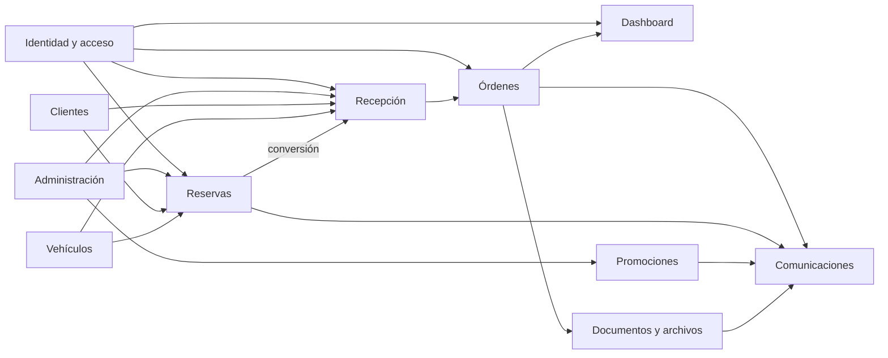
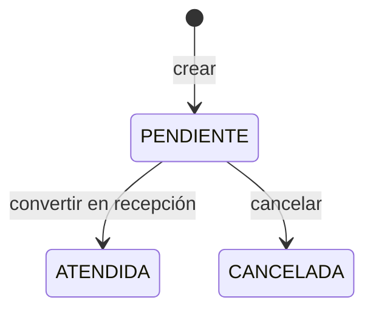
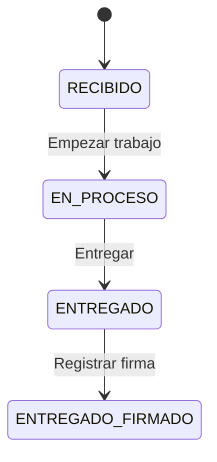

# Casa Tuning — Especificación de módulos del sistema

## 1. Objetivo

Este documento define límites de dominio y contratos funcionales para Casa Tuning. Su propósito es permitir que cada módulo evolucione sin invadir responsabilidades ajenas.

El inventario de funciones concretas, firmas y efectos está en [6_catalogo_de_funciones.md](./6_catalogo_de_funciones.md).

Cada especificación distingue:

- **Responsabilidad:** razón única de existir.
- **Fuera de alcance:** decisiones que pertenecen a otro módulo.
- **Estado:** datos persistentes y estado efímero.
- **Entradas y salidas:** contrato observable.
- **Invariantes:** reglas que siempre deben cumplirse.
- **Colaboraciones:** dependencias con otros módulos.
- **Criterios de aceptación:** base verificable para desarrollo.

## 2. Mapa de dominios



## 3. Matriz de acceso

| Módulo | Operador | Administrador | Acceso público |
|---|:---:|:---:|:---:|
| Login y políticas | Sí | Sí | Sí |
| Dashboard | Lectura | Lectura | No |
| Reservas | Gestionar | Gestionar | No |
| Recepción | Gestionar | Gestionar | No |
| Órdenes | Gestionar | Gestionar | No |
| Clientes | No | Gestionar | No |
| Vehículos | No | Gestionar | No |
| Promociones | No | Gestionar | No |
| Administración | No | Gestionar | No |

“Gestionar” no implica eliminar indiscriminadamente. Cada recurso conserva las restricciones de integridad descritas en este documento.

---

## 4. Módulo de identidad y acceso

### 4.1 Responsabilidad única

Autenticar al personal, construir la sesión y autorizar cada operación según el estado y rol vigente del usuario.

### 4.2 Fuera de alcance

- No administra perfiles de clientes.
- No decide estados de una orden.
- No envía campañas.
- No debe exponer hashes o contraseñas.

### 4.3 Componentes actuales

| Tipo | Componente | Responsabilidad |
|---|---|---|
| UI | `src/app/login/page.tsx` | Formulario de ingreso y visualización de error. |
| Aplicación | `src/modules/auth/actions.ts` | `authenticate` y `logoutAction`. |
| Configuración | `src/auth.ts` | Proveedor Credentials, consulta del usuario y bcrypt. |
| Configuración | `src/auth.config.ts` | Callbacks JWT/sesión y redirecciones. |
| Seguridad | `src/lib/auth-helpers.ts` | `verifySession` y `verifyAdminSession`. |
| Persistencia | `User`, `Role` | Identidad, estado activo y rol. |

### 4.4 Estado

- Persistente: usuario, correo, hash bcrypt, rol, indicador activo.
- Sesión: JWT con `id` y `role`.
- UI: estado del formulario y mensaje de autenticación.

### 4.5 Invariantes

1. El correo de usuario es único.
2. Un usuario inactivo no puede iniciar ni conservar acceso operativo.
3. Una acción administrativa debe llamar `verifyAdminSession()`.
4. La contraseña nunca se almacena en texto claro.
5. El rol debe existir antes de crear el usuario.
6. El servidor vuelve a consultar el usuario para comprobar `isActive`.

### 4.6 Brecha vigente

La creación de usuario envía por correo la contraseña proporcionada. El contrato objetivo es emitir un token de activación de un solo uso, con expiración y revocación, sin enviar secretos permanentes.

### 4.7 Criterios de aceptación mínimos

- Credenciales inválidas devuelven un mensaje genérico.
- Un operador no puede ejecutar ninguna Server Action administrativa aunque invoque la acción directamente.
- Desactivar un usuario invalida su acceso en la siguiente comprobación de sesión.
- El sistema no registra contraseñas, hashes ni tokens en logs.

---

## 5. Módulo Dashboard

### 5.1 Responsabilidad única

Proyectar el estado operativo del taller y dirigir al usuario hacia las acciones urgentes.

### 5.2 Componentes actuales

- Página de servidor: `src/app/(authenticated)/dashboard/page.tsx`.
- Acción rápida: `src/components/DashboardFAB.tsx`.
- Datos: órdenes, estados y actividad.

### 5.3 Indicadores implementados

| Indicador | Regla actual |
|---|---|
| En proceso | Cantidad de órdenes con estado `EN_PROCESO`. |
| Entregas sin firmar | `ENTREGADO` con `signatureUrl = null`. |
| Recibidos hoy | Estado `RECIBIDO` y creación desde el inicio del día del servidor. |
| Total del día | Toda orden creada desde el inicio del día del servidor. |
| Órdenes activas | No entregadas, más entregadas sin firma. |
| Actividad reciente | Últimos cinco registros por fecha descendente. |

### 5.4 Estado y flujo

El Dashboard no mantiene estado de negocio propio. Es una proyección de lectura calculada en cada render del servidor. El único estado local relevante pertenece a la presentación del botón flotante.

### 5.5 Invariantes

1. No modifica órdenes directamente.
2. Sus métricas deben derivarse de una zona horaria de negocio explícita; el uso actual de la zona del servidor debe migrar a `America/Bogota`.
3. Una tarjeta no debe introducir una definición distinta de “activo” respecto al módulo de Órdenes.

### 5.6 Criterios de aceptación

- Las consultas independientes se ejecutan en paralelo.
- Las cifras y el listado usan la misma fuente transaccional.
- Una orden entregada y firmada no aparece como activa.
- Una orden entregada sin firma permanece visible como pendiente operativa.

---

## 6. Módulo de reservas

### 6.1 Responsabilidad única

Agendar la intención de visita de un cliente, reservar servicios y facilitar su conversión en recepción.

### 6.2 Fuera de alcance

- No representa trabajo ejecutado.
- No genera una orden hasta la llegada del vehículo.
- No gestiona evidencias, firma ni documento de entrega.

### 6.3 Componentes actuales

| Tipo | Componente |
|---|---|
| Página | `src/app/(authenticated)/reservas/page.tsx` |
| UI | `ReservasClientView.tsx`, `ReservaFormModal.tsx` |
| Aplicación | `reservas/actions.ts` |
| Automatización | `api/cron/reminders/route.ts` |
| Integración | Funciones de reserva en `lib/whatsapp.ts` |
| Datos | `Reservation`, `ReservationService` |

### 6.4 Máquina de estados



El esquema admite texto libre y la acción de actualización recibe un `status` sin lista cerrada. La UI vigente opera con `PENDIENTE`, `ATENDIDA` y `CANCELADA`. Cualquier estado adicional requiere primero actualizar esta especificación y cerrar la validación en servidor.

### 6.5 Reglas de negocio actuales

1. Nombre y celular son obligatorios.
2. El celular se normaliza a exactamente 10 dígitos colombianos.
3. Debe existir al menos un servicio.
4. No se permiten fechas anteriores al día actual en Bogotá.
5. No se agenda en domingo.
6. Horario de lunes a viernes: 8:30 a. m. a 6:30 p. m.
7. Horario de sábado: 8:00 a. m. a 6:30 p. m.
8. El vehículo puede estar registrado o describirse con placa/modelo/marca.
9. La creación genera confirmación de WhatsApp de forma posterior a la respuesta.
10. El recordatorio exitoso marca `reminderSent` y `reminderSentAt`.
11. La conversión a recepción marca la reserva `ATENDIDA` dentro de la transacción de la orden.

### 6.6 Gestión del estado

- Persistente: cita, cliente, vehículo opcional, servicios, notas y recordatorio.
- UI: búsqueda, filtros, modal, formulario, reserva en edición y confirmación de cancelación.
- Derivado: “hoy”, “próximas”, “atendidas” y “canceladas”.

### 6.7 Contrato de creación

```ts
interface CreateReservationCommand {
  clientName: string;
  clientPhone: string;
  clientEmail?: string;
  scheduledAt: string;
  services: number[];
  carId?: number;
  vehiclePlate?: string;
  vehicleModel?: string;
  brandId?: number;
  notes?: string;
}
```

### 6.8 Interacciones

- Clientes: busca por teléfono; actualiza nombre y correo o crea el cliente.
- Vehículos: referencia un vehículo existente o guarda datos temporales en la reserva.
- Recepción: precarga los datos mediante `reservationId`.
- Comunicaciones: confirmación y recordatorio por plantilla.
- Administración: consume catálogos de marcas y servicios activos.

### 6.9 Riesgos y contrato objetivo

- El código `RES-2026-####` usa un año fijo y `count + 1`; debe generarse con año de Bogotá y secuencia resistente a concurrencia.
- El cron consulta solo `PENDIENTE`, aunque especificaciones anteriores mencionaban `CONFIRMADA`.
- No existe control de capacidad ni solapamiento de citas.
- El recordatorio no tiene tabla de intentos; solo un booleano final.

### 6.10 Criterios de aceptación

- Una cita inválida no crea ni modifica cliente.
- Una reserva confirmada en base de datos no se revierte por falla de WhatsApp.
- Convertir una reserva y crear la orden ocurre atómicamente.
- Una reserva ya atendida o cancelada no puede convertirse desde el backend.
- Un recordatorio reintentado no debe duplicarse si el proveedor ya lo aceptó.

---

## 7. Módulo de recepción

### 7.1 Responsabilidad única

Formalizar el ingreso del vehículo y crear el expediente operativo que inicia una orden.

### 7.2 Componentes actuales

| Tipo | Componente |
|---|---|
| Página | `src/app/(authenticated)/recepcion/page.tsx` |
| UI | `src/components/RecepcionForm.tsx` |
| Aplicación | `recepcion/actions.ts` |
| Datos | `Order`, `OrderService`, `ActivityLog`, cliente y vehículo |
| Archivos | Firma, evidencias y ficha técnica |

### 7.3 Entradas

```ts
interface ReceptionCommand {
  orderId?: number;             // presente al editar
  reservationId?: number;       // presente al convertir
  clientName: string;
  clientPhone: string;
  clientPhone2?: string;
  clientEmail?: string;
  clientDocumentTypeId?: number;
  clientDocumentNumber?: string;
  vehicleType?: string;
  plate: string;
  year: number;
  brandId: number;
  model: string;
  color: string;
  mileage?: string;
  services: number[];
  serviceDescription?: string;
  observations?: string;
  checklist?: Record<string, unknown>;
  signature?: string;           // data URL de imagen
}
```

### 7.4 Reglas de cliente

1. Nombre y celular son obligatorios.
2. Documento y tipo de documento son opcionales.
3. El teléfono identifica al cliente existente.
4. Correo, si existe, debe tener formato válido y no pertenecer a otro teléfono.
5. Documento nuevo se cifra; su hash normalizado impide duplicados.
6. El valor enmascarado `********` significa “conservar documento actual”.

### 7.5 Reglas de vehículo

1. Placa normalizada en mayúsculas, alfanumérica, de 5 a 6 caracteres.
2. Marca, modelo, año y color son obligatorios.
3. Solo puede existir un vehículo activo con la misma placa según la regla de aplicación.
4. Si la placa activa pertenece a otro cliente, la recepción se bloquea.
5. Si pertenece al mismo cliente, se actualizan sus datos.

### 7.6 Reglas de orden

1. Debe seleccionarse al menos un servicio.
2. El estado inicial es `RECIBIDO` y debe existir en catálogo.
3. Orden, servicios y actividad se crean dentro de la misma transacción.
4. Solo una orden `RECIBIDO` puede editarse.
5. El código actual es `CT-2026-####`; se debe reemplazar por generación concurrente y año dinámico.

### 7.7 Estado y efectos

| Momento | Operación | Consistencia |
|---|---|---|
| Antes de confirmar | Sesión, normalización y validación | Sin cambios persistentes |
| Transacción | Cliente, vehículo, orden, servicios, actividad, reserva | Atómica |
| Después de responder | Firma, evidencias, PDF, email y WhatsApp | Eventual |

### 7.8 Interacciones

- Reservas entrega datos precargados y recibe el cambio a `ATENDIDA`.
- Clientes y Vehículos actúan como registros maestros.
- Administración provee marcas, documentos y servicios activos.
- Órdenes recibe el expediente creado.
- Documentos genera y publica la ficha.
- Comunicaciones confirma la recepción.

### 7.9 Criterios de aceptación

- Omitir documento no impide crear la recepción.
- Una validación fallida no deja un cliente o vehículo huérfano.
- La orden recién creada tiene estado `RECIBIDO`, creador y actividad.
- El fallo de R2 o mensajería queda registrado y no elimina la orden.
- La UI informa éxito del registro principal sin prometer que el mensaje externo fue entregado.

---

## 8. Módulo de órdenes y seguimiento

### 8.1 Responsabilidad única

Gestionar la ejecución del servicio desde la recepción hasta la entrega y conservar su trazabilidad.

### 8.2 Componentes actuales

- Página: `src/app/(authenticated)/ordenes/page.tsx`.
- UI: `src/components/OrdenesClientView.tsx`.
- Aplicación: `ordenes/actions.ts`.
- Datos: `Order`, `OrderStatus`, `ActivityLog`, `OrderComment`, `OrderNotification`.

### 8.3 Estados

El catálogo inicial contiene `RECIBIDO`, `EN_PROCESO`, `LISTO` y `ENTREGADO`; la UI vigente ejecuta:



`LISTO` existe en datos, pero no forma parte del flujo principal de botones. La firma se representa por `signatureUrl`, no por un estado distinto en la tabla.

### 8.4 Reglas vigentes

1. Cambiar estado registra una actividad dentro de la misma transacción.
2. El backend comprueba que el estado destino exista, pero aún no valida el arco de transición.
3. Los comentarios de servidor solo se aceptan en `EN_PROCESO` o `LISTO`.
4. La UI muestra formulario también en algunas condiciones diferentes; el servidor es la autoridad.
5. El documento de entrega solo se carga cuando la orden está `ENTREGADO`.
6. Una firma puede registrarse después de la entrega.
7. La ficha técnica se puede regenerar y publicar bajo una URL estable.
8. Si se entrega con firma, se envían comunicaciones de entrega.
9. Si se entrega sin firma, se envía aviso de vehículo listo por WhatsApp.

### 8.5 Contrato objetivo de transición

```ts
type OrderState = "RECIBIDO" | "EN_PROCESO" | "LISTO" | "ENTREGADO";

const allowedTransitions: Record<OrderState, readonly OrderState[]> = {
  RECIBIDO: ["EN_PROCESO"],
  EN_PROCESO: ["LISTO"],
  LISTO: ["ENTREGADO"],
  ENTREGADO: [],
};
```

Antes de adoptar este contrato debe decidirse si `LISTO` vuelve al flujo o se elimina del catálogo. La decisión debe ser única para UI, acciones, mensajes y métricas.

### 8.6 Estado

- Persistente: cabecera, estado, servicios, firma, checklist, documentos y comentarios.
- Derivado: “firma pendiente” = `ENTREGADO` sin `signatureUrl`.
- UI: filtros, tarjeta expandida, orden seleccionada, modales, firma y carga de PDF.

### 8.7 Criterios de aceptación

- Una transición no permitida se rechaza en servidor.
- Todo cambio de estado incluye actor, origen, destino y fecha.
- Registrar firma regenera la ficha técnica.
- Una orden entregada con firma dispara como máximo una notificación lógica de cada tipo.
- El documento eliminado se desvincula aun si R2 no puede borrarlo; la inconsistencia debe quedar observable.

---

## 9. Módulo de clientes

### 9.1 Responsabilidad única

Mantener el registro maestro del cliente y presentar su relación con vehículos e historial de órdenes.

### 9.2 Componentes

- Página y UI: `/clientes`, `ClientesClientView.tsx`.
- Acciones: crear, actualizar, asociar vehículo y subir foto.
- Acceso: solo Administrador.

### 9.3 Invariantes

1. Nombre normalizado no vacío.
2. Teléfono único de exactamente 10 dígitos.
3. Correo opcional, con formato válido y unicidad lógica aplicada por código.
4. Documento opcional, único mediante `documentNumberHash`.
5. Documento cifrado en reposo en la columna de aplicación.
6. Una nueva foto reemplaza y trata de eliminar la anterior.

### 9.4 Estado

- Persistente: identidad, contacto, documento, foto y relaciones.
- UI: búsqueda, cliente seleccionado, drawer y modales.
- Datos derivados: vehículos e historial de órdenes.

### 9.5 Fuera de alcance

El módulo no crea órdenes por sí mismo. La creación rápida de vehículo solo actualiza el registro maestro.

### 9.6 Criterios de aceptación

- Ningún operador puede leer el CRM administrativo.
- La interfaz no recibe documento descifrado si la vista no lo necesita.
- El borrado de un cliente con historial no debe ofrecerse sin política explícita.
- Los conflictos de teléfono, correo o documento producen mensajes específicos sin filtrar otros datos.

---

## 10. Módulo de vehículos

### 10.1 Responsabilidad única

Mantener el registro maestro de vehículos, su propietario actual y su activación lógica.

### 10.2 Componentes

- Página y UI: `/vehiculos`, `VehiculosClientView.tsx`.
- Acciones: `createCarAdminAction`, `updateCarAdminAction`.
- Datos: `Car`, `Brand`, `Client`.
- Acceso: solo Administrador.

### 10.3 Invariantes

1. Placa normalizada de 5 a 6 caracteres alfanuméricos.
2. Un vehículo activo no puede compartir placa con otro vehículo activo según la capa de aplicación.
3. La restricción física actual es `(plate, clientId)`, por lo que la validación global depende del servidor.
4. Marca y propietario deben existir.
5. Desactivar conserva historial; no elimina órdenes.

### 10.4 Interacciones

- Clientes define el propietario.
- Administración define las marcas.
- Reservas y Recepción pueden seleccionar vehículos activos.
- Órdenes conserva la relación histórica.
- Promociones usa la marca de vehículos activos para segmentar.

### 10.5 Criterios de aceptación

- Transferir propiedad requiere desactivar o actualizar de forma explícita; no debe crear dos placas activas.
- Un vehículo con órdenes no se elimina físicamente.
- Las consultas operativas distinguen activo de histórico.

---

## 11. Módulo de promociones y campañas

### 11.1 Responsabilidad única

Crear una campaña segmentada y coordinar el envío de una plantilla aprobada por WhatsApp a clientes seleccionados.

### 11.2 Componentes

| Tipo | Componente |
|---|---|
| Página/UI | `/promociones`, `PromocionesClientView.tsx` |
| Aplicación | `promociones/actions.ts` |
| Integración | `sendWhatsAppPromotionAction` |
| Datos | `Promotion`, `PromotionClient` |
| Archivos | URL prefirmada de R2 para cabecera multimedia |

### 11.3 Flujo actual

1. El administrador consulta plantillas aprobadas en Kapso.
2. Selecciona nombre, servicio, marca, plantilla, archivo y destinatarios.
3. El servidor crea `Promotion`.
4. Se inicia un bucle secuencial no durable.
5. Por cliente se envía WhatsApp, se registra `SENT` o `FAILED` y se espera 200 ms.

### 11.4 Invariantes

1. Solo Administrador crea campañas o URLs de subida.
2. Deben existir servicio, marca, plantilla y al menos un cliente.
3. Cada pareja campaña/cliente es única.
4. El estado registrado debe corresponder al resultado observable del intento.
5. El archivo debe ser compatible con el encabezado de la plantilla.

### 11.5 Contrato objetivo

```ts
type CampaignRecipientState =
  | "PENDING"
  | "PROCESSING"
  | "SENT"
  | "DELIVERED"
  | "READ"
  | "FAILED"
  | "OPTED_OUT";
```

La implementación actual solo registra `SENT`/`FAILED` y no recibe webhooks de entrega o lectura.

### 11.6 Riesgos

- El proceso puede cortarse al terminar la invocación del servidor.
- No hay reintentos, cancelación ni control de duplicados a nivel de proveedor.
- No existe consentimiento u opt-out modelado.
- La segmentación se calcula en la UI a partir de vehículos activos; debe revalidarse en servidor.

### 11.7 Criterios de aceptación

- Un destinatario no consentido no entra en la cola.
- La campaña muestra totales por estado sin inferir entrega a partir de “aceptado por API”.
- Reintentar solo procesa fallos elegibles y preserva idempotencia.
- El envío masivo es durable, observable y recuperable.

---

## 12. Módulo de administración

### 12.1 Responsabilidad única

Gestionar catálogos y usuarios que configuran la operación: servicios, marcas, roles y personal.

### 12.2 Componentes

- Página/UI: `/administracion`, `AdministracionClientView.tsx`.
- Acciones: CRUD parcial de servicios y marcas; creación de usuarios; prueba de WhatsApp.
- Acceso: solo Administrador.

### 12.3 Servicios

- Nombre único.
- Icono opcional.
- Indicador `isTopSelling` para priorización visual.
- Activación lógica.
- No se elimina si está asociado a órdenes; el código también puede fallar si está asociado a reservas o promociones.

### 12.4 Marcas

- Nombre único.
- Logo opcional almacenado en R2.
- Actualizar logo intenta eliminar el anterior.
- No existe acción de eliminación vigente.

### 12.5 Usuarios

- Nombre, correo, contraseña y rol obligatorios.
- Contraseña mínima actual: seis caracteres.
- Correo normalizado en minúsculas y único.
- Usuario creado activo.
- No existe en este módulo una acción implementada para editar, desactivar o restablecer contraseña.

### 12.6 Criterios de aceptación

- Un catálogo en uso se desactiva en lugar de eliminarse.
- Cambiar un servicio revalida las vistas que lo consumen.
- Un usuario nunca puede asignarse a un rol inexistente.
- La prueba de WhatsApp no expone la API key al navegador.

---

## 13. Módulo de comunicaciones

### 13.1 Responsabilidad única

Transformar eventos del negocio en mensajes externos sin decidir el resultado del proceso operativo.

### 13.2 Canales

| Canal | Adaptador | Eventos actuales |
|---|---|---|
| Correo | Resend | Bienvenida, recepción, entrega; existe plantilla “listo”. |
| WhatsApp | Kapso/Meta | Recepción, entrega, recomendaciones, vehículo listo, reserva, recordatorio y campaña. |

### 13.3 Reglas

1. Un fallo de comunicación no revierte la orden o reserva.
2. El correo usa claves de idempotencia basadas en entidad y tipo.
3. WhatsApp registra en `OrderNotification` solo los envíos de orden aceptados.
4. La aceptación del proveedor no equivale a entrega al dispositivo.
5. Todo mensaje debe usar datos mínimos y una plantilla aprobada cuando corresponda.

### 13.4 Estado objetivo

Definir un puerto común:

```ts
interface NotificationPort {
  enqueue(message: NotificationMessage): Promise<{ notificationId: string }>;
}

interface NotificationMessage {
  idempotencyKey: string;
  channel: "EMAIL" | "WHATSAPP";
  template: string;
  recipient: string;
  variables: Record<string, string>;
  correlation: { orderId?: number; reservationId?: number; promotionId?: number };
}
```

## 14. Módulo de documentos y archivos

### 14.1 Responsabilidad única

Generar documentos, almacenar binarios y devolver referencias estables al resto del sistema.

### 14.2 Objetos administrados

- firmas;
- evidencias del checklist;
- fotos de cliente;
- logos de marca;
- archivos de campaña;
- fichas técnicas;
- documentos de entrega.

### 14.3 Reglas

1. PostgreSQL guarda metadatos o URL; R2 guarda el binario.
2. El nombre de objeto debe ser determinista cuando se desea sobrescribir una versión lógica.
3. Los archivos sensibles no deberían ser públicos; el estado actual usa URLs públicas.
4. La URL prefirmada de campaña expira actualmente en una hora.
5. El tipo MIME debe validarse en servidor y no confiar solo en la extensión.
6. La ficha técnica incluye cliente, vehículo, servicios, checklist, evidencias, observaciones, comentarios y firma disponible.

### 14.4 Criterios de aceptación

- Una subida fallida no deja una URL inexistente en base.
- Sustituir un archivo no invalida documentos que deban ser históricos.
- Un archivo descargado tiene el tipo y nombre correctos.
- Los límites de tamaño y tipos permitidos están definidos por caso de uso.

---

## 15. Reglas transversales para nuevos módulos

Antes de iniciar código, cada módulo nuevo debe responder:

1. ¿Cuál es su única responsabilidad?
2. ¿Qué datos posee y qué datos solo referencia?
3. ¿Quién puede leerlo y mutarlo?
4. ¿Cuáles son sus estados y transiciones válidas?
5. ¿Qué operación necesita transacción?
6. ¿Qué efectos son eventuales?
7. ¿Qué clave hace idempotente cada comando?
8. ¿Cómo se auditan sus cambios?
9. ¿Cómo se recupera de un proveedor caído?
10. ¿Qué pruebas demuestran sus invariantes?

Ningún módulo se considera especificado si sus respuestas dependen exclusivamente del comportamiento visual de un componente.

## 16. Documento relacionado

- [Catálogo técnico de funciones](./6_catalogo_de_funciones.md)
