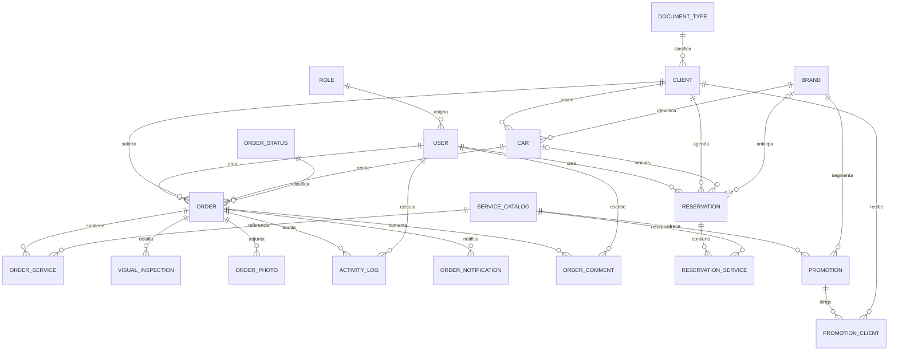

# Casa Tuning — Modelo de datos

## 1. Alcance y fuente de verdad

El modelo lógico vigente está definido en `prisma/schema.prisma` y usa PostgreSQL mediante Prisma 7.8.

Existe una brecha operacional crítica:

- La carpeta de migraciones solo contiene `20260609160010_init`.
- Esa migración inicial no contiene varias entidades y columnas presentes en el esquema actual.
- Reservas, promociones, comentarios, tipos de documento, documentos cifrados y otros campos no pueden reconstruirse únicamente con el historial versionado.

Por tanto:

> `schema.prisma` describe la intención actual, pero `prisma/migrations` todavía no constituye una historia reproducible del esquema desplegado.

Antes de un staging nuevo se debe reconciliar la base real, crear una línea base revisada y validar la migración sobre una copia restaurable.

## 2. Convenciones

| Concepto | Convención actual |
|---|---|
| Tablas | `snake_case` plural o nombre de catálogo, mediante `@@map`. |
| Columnas | `snake_case` en PostgreSQL y `camelCase` en Prisma. |
| Claves primarias | `Int` autoincremental. |
| Fechas | `DateTime`; la migración inicial usa `TIMESTAMP(3)`. |
| Identificadores de negocio | `Order.code` y `Reservation.code`, únicos. |
| Borrado lógico | `isActive` en usuario, vehículo y servicio. |
| Relaciones N:M | Entidades puente con clave primaria compuesta. |

### 2.1 Convención objetivo

- Mantener `camelCase` en TypeScript y `snake_case` en PostgreSQL.
- Explicitar `onDelete` en toda relación.
- Usar `TIMESTAMPTZ` para fechas nuevas y normalizar fechas existentes mediante migración controlada.
- Indexar todas las claves foráneas y combinaciones frecuentes de filtro/orden.
- Evitar identificadores generados con `count + 1`.

## 3. Diagrama entidad–relación



## 4. Dominios de datos

| Dominio | Entidades propietarias |
|---|---|
| Identidad | `Role`, `User` |
| CRM | `DocumentType`, `Client` |
| Vehículos | `Brand`, `Car` |
| Catálogo | `ServiceCatalog`, `OrderStatus` |
| Operación | `Order`, `OrderService`, `VisualInspection`, `OrderPhoto` |
| Trazabilidad | `ActivityLog`, `OrderComment`, `OrderNotification` |
| Agenda | `Reservation`, `ReservationService` |
| Marketing | `Promotion`, `PromotionClient` |

---

## 5. Diccionario: identidad

### 5.1 `roles` — modelo `Role`

| Campo | Tipo Prisma / DB | Nulo | Regla |
|---|---|:---:|---|
| `id` | `Int` / integer autoincremental | No | PK. |
| `name` | `String` / varchar(50) | No | Único; valores iniciales `Administrador`, `Operador`. |
| `description` | `String?` / varchar(255) | Sí | Descripción funcional. |

Relación: un rol tiene muchos usuarios.

### 5.2 `users` — modelo `User`

| Campo | Tipo | Nulo | Regla |
|---|---|:---:|---|
| `id` | `Int` | No | PK. |
| `name` | varchar(100) | No | Nombre visible. |
| `email` | varchar(150) | No | Único; normalizado a minúsculas al crear desde administración. |
| `password_hash` | varchar(255) | No | Hash bcrypt; nunca exponer. |
| `is_active` | boolean | No | `true` por defecto; controla acceso. |
| `created_at` | `DateTime` | No | Fecha de alta. |
| `role_id` | integer | No | FK a `roles.id`; indexada. |

Relaciones: crea órdenes y reservas; puede generar actividades y comentarios.

Política de eliminación recomendada: no borrar usuarios con actividad. Desactivar y conservar identidad histórica.

---

## 6. Diccionario: CRM

### 6.1 `document_types` — modelo `DocumentType`

| Campo | Tipo | Nulo | Regla |
|---|---|:---:|---|
| `id` | `Int` | No | PK. |
| `code` | varchar(10) | No | Único: `CC`, `CE`, `NIT`, `PP`, `TI` en el seed. |
| `name` | varchar(100) | No | Etiqueta descriptiva. |

### 6.2 `clients` — modelo `Client`

| Campo | Tipo | Nulo | Regla |
|---|---|:---:|---|
| `id` | `Int` | No | PK. |
| `name` | varchar(150) | No | Nombre completo o razón social. |
| `phone` | varchar(20) | No | Único; aplicación exige 10 dígitos. |
| `phone2` | varchar(20) | Sí | Contacto secundario. |
| `document_number` | text | Sí | Documento cifrado; no contiene texto claro en registros nuevos. |
| `document_number_hash` | varchar(64) | Sí | Único; SHA-256 del documento normalizado. |
| `document_type_id` | integer | Sí | FK a `document_types.id`. |
| `email` | varchar(150) | Sí | Validación y unicidad lógica en aplicación; no tiene `@unique`. |
| `photo_url` | text | Sí | URL del avatar en R2. |
| `created_at` | `DateTime` | No | Fecha de alta. |

Relaciones: vehículos, órdenes, reservas y campañas recibidas.

### 6.3 Clasificación de datos del cliente

| Dato | Clasificación | Protección mínima |
|---|---|---|
| Nombre | Personal | Acceso autenticado y mínimo privilegio. |
| Teléfonos/correo | Personal de contacto | No incluir completos en logs. |
| Documento | Personal sensible | Cifrado, acceso administrativo justificado y auditoría. |
| Hash de documento | Seudónimo enlazable | Tratar como sensible; permite correlación. |
| Foto | Personal | Objeto privado o URL firmada; retención definida. |

---

## 7. Diccionario: vehículos y catálogos

### 7.1 `brands` — modelo `Brand`

| Campo | Tipo | Nulo | Regla |
|---|---|:---:|---|
| `id` | `Int` | No | PK. |
| `name` | varchar(50) | No | Único. |
| `logo` | text | Sí | URL de R2; el comentario antiguo del esquema indica Base64, pero la aplicación guarda URL. |

### 7.2 `cars` — modelo `Car`

| Campo | Tipo | Nulo | Regla |
|---|---|:---:|---|
| `id` | `Int` | No | PK. |
| `plate` | varchar(10) | No | Parte de la unicidad compuesta `(plate, clientId)`. |
| `type` | varchar(30) | No | Por defecto `Automóvil`. |
| `model` | varchar(100) | No | Modelo comercial. |
| `year` | integer | No | Año del vehículo. |
| `color` | varchar(50) | No | Descripción del color. |
| `is_active` | boolean | No | Permite preservar vehículos históricos. |
| `client_id` | integer | No | FK a cliente; `onDelete: Cascade`. |
| `brand_id` | integer | No | FK a marca. |

Índices actuales declarados: `clientId`, `brandId` y único compuesto `(plate, clientId)`.

**Invariante de aplicación:** solo una fila activa puede usar una placa, aunque pertenezca a otro cliente. La base no garantiza esa regla global. El estado objetivo es un índice único parcial:

```sql
CREATE UNIQUE INDEX cars_active_plate_unique
ON cars (plate)
WHERE is_active = true;
```

Debe aplicarse solo después de auditar duplicados.

### 7.3 `service_catalog` — modelo `ServiceCatalog`

| Campo | Tipo | Nulo | Regla |
|---|---|:---:|---|
| `id` | `Int` | No | PK. |
| `name` | varchar(100) | No | Único. |
| `is_active` | boolean | No | Oculta el servicio en nuevas operaciones sin borrar historia. |
| `icon` | varchar(50) | Sí | Nombre de icono Lucide permitido por UI. |
| `is_top_selling` | boolean | No | Ordena servicios destacados primero en Recepción. |

### 7.4 `order_statuses` — modelo `OrderStatus`

| Campo | Tipo | Nulo | Regla |
|---|---|:---:|---|
| `id` | `Int` | No | PK. |
| `name` | varchar(50) | No | Único. |
| `description` | varchar(255) | Sí | Significado operativo. |

El seed contiene `RECIBIDO`, `EN_PROCESO`, `LISTO` y `ENTREGADO`. La secuencia válida no está codificada en la base.

---

## 8. Diccionario: operación

### 8.1 `orders` — modelo `Order`

| Campo | Tipo | Nulo | Regla |
|---|---|:---:|---|
| `id` | `Int` | No | PK. |
| `code` | varchar(20) | No | Identificador de negocio único. |
| `mileage` | varchar(50) | Sí | La aplicación conserva solo dígitos; debería migrarse a entero no negativo si no requiere formato. |
| `signature_url` | varchar(255) | Sí | URL de firma en R2; también indica conformidad pendiente/completa. |
| `observations` | text | Sí | Hallazgos generales. |
| `service_description` | text | Sí | Detalle del trabajo solicitado. |
| `checklist` | JSON | Sí | Inspección y referencias a evidencias. PostgreSQL debe materializarlo como `jsonb`. |
| `created_at` | `DateTime` | No | Creación. |
| `updated_at` | `DateTime` | No | Actualización automática de Prisma. |
| `status_id` | integer | No | FK a estado; indexada. |
| `client_id` | integer | No | FK a cliente; indexada. |
| `car_id` | integer | No | FK a vehículo; indexada. |
| `creator_id` | integer | No | FK a usuario; falta índice explícito. |
| `delivery_pdf_url` | varchar(255) | Sí | Documento de entrega/factura cargado. |

Relaciones hijas: servicios, inspecciones, fotos, actividad, notificaciones y comentarios.

### 8.2 `order_services` — modelo `OrderService`

| Campo | Tipo | Nulo | Regla |
|---|---|:---:|---|
| `order_id` | integer | No | FK a orden; cascade al borrar orden. |
| `service_id` | integer | No | FK a catálogo; indexada. |

PK compuesta: `(order_id, service_id)`. Evita repetir un servicio en una orden.

### 8.3 `visual_inspections` — modelo `VisualInspection`

| Campo | Tipo | Nulo | Regla |
|---|---|:---:|---|
| `id` | `Int` | No | PK. |
| `part_name` | varchar(100) | No | Parte inspeccionada. |
| `order_id` | integer | No | FK indexada; cascade. |

Esta entidad existe en el esquema, pero el flujo actual guarda el checklist en `Order.checklist`. Debe decidirse si se elimina o se convierte en el modelo normalizado de inspección.

### 8.4 `order_photos` — modelo `OrderPhoto`

| Campo | Tipo | Nulo | Regla |
|---|---|:---:|---|
| `id` | `Int` | No | PK. |
| `r2_url` | varchar(255) | No | Referencia a R2. |
| `uploaded_at` | `DateTime` | No | Fecha de subida. |
| `order_id` | integer | No | FK indexada; cascade. |

La implementación actual guarda evidencias dentro del JSON del checklist. Esta tabla está disponible, pero no es la fuente usada por el flujo auditado.

---

## 9. Contrato del checklist

### 9.1 Forma actual

```json
{
  "rayones": "si",
  "golpes": "no",
  "pintura": "bueno",
  "rines": "regular",
  "_images_rayones": [
    "https://cdn.example.com/checklist-images/CT-2026-0001-rayones-0.jpg"
  ]
}
```

Las claves que empiezan por `_images_` se excluyen del listado textual y se renderizan como evidencia en el PDF.

### 9.2 Esquema objetivo

El formato debe versionarse para evitar claves arbitrarias y valores contradictorios:

```json
{
  "$schema": "https://json-schema.org/draft/2020-12/schema",
  "title": "CasaTuningReceptionChecklistV1",
  "type": "object",
  "required": ["version", "items"],
  "additionalProperties": false,
  "properties": {
    "version": { "const": 1 },
    "items": {
      "type": "array",
      "items": {
        "type": "object",
        "required": ["code", "result", "evidenceUrls"],
        "additionalProperties": false,
        "properties": {
          "code": { "type": "string", "minLength": 1 },
          "result": { "enum": ["OK", "REGULAR", "FALLA", "NO_APLICA"] },
          "note": { "type": "string" },
          "evidenceUrls": {
            "type": "array",
            "items": { "type": "string", "format": "uri" }
          }
        }
      }
    }
  }
}
```

**Regla objetivo:** la transacción no debe persistir Base64 voluminoso en JSON. Los objetos se suben primero a un área temporal o mediante URL prefirmada y luego se confirman sus referencias.

---

## 10. Diccionario: trazabilidad

### 10.1 `activity_logs` — modelo `ActivityLog`

| Campo | Tipo | Nulo | Regla |
|---|---|:---:|---|
| `id` | `Int` | No | PK. |
| `description` | text | No | Texto del evento. |
| `created_at` | `DateTime` | No | Momento del evento. |
| `order_id` | integer | No | FK a orden; indexada; cascade. |
| `user_id` | integer | Sí | Actor; debe preservarse o ponerse nulo al retirar usuario. |

Estado objetivo: agregar `eventType`, `fromState`, `toState`, `metadata`, `requestId` y evitar depender de texto libre para auditoría.

### 10.2 `order_comments` — modelo `OrderComment`

| Campo | Tipo | Nulo | Regla |
|---|---|:---:|---|
| `id` | `Int` | No | PK. |
| `content` | text | No | Comentario no vacío. |
| `created_at` | `DateTime` | No | Fecha. |
| `order_id` | integer | No | FK indexada; cascade. |
| `user_id` | integer | No | FK a autor; cascade actual. |

No se recomienda borrar comentarios por eliminar un usuario; debe conservarse un actor desactivado o anonimizado.

### 10.3 `order_notifications` — modelo `OrderNotification`

| Campo | Tipo | Nulo | Regla |
|---|---|:---:|---|
| `id` | `Int` | No | PK. |
| `platform` | varchar(50) | No | Actualmente `WHATSAPP`; permite `EMAIL`. |
| `notification_type` | varchar(50) | No | `RECEPCION`, `ENTREGA`, `RECOMENDACIONES`, `VEHICULO_LISTO`. |
| `sent_at` | `DateTime` | No | Fecha de aceptación del proveedor. |
| `order_id` | integer | No | FK indexada; cascade. |

No existe restricción de idempotencia. Estado objetivo: índice único lógico por `orderId`, canal, tipo y versión de plantilla, además de estados de intento y entrega.

---

## 11. Diccionario: reservas

### 11.1 `reservations` — modelo `Reservation`

| Campo | Tipo | Nulo | Regla |
|---|---|:---:|---|
| `id` | `Int` | No | PK. |
| `code` | varchar(20) | No | Único. |
| `scheduled_at` | `DateTime` | No | Fecha/hora interpretada en `America/Bogota`. |
| `status` | varchar(20) | No | `PENDIENTE` por defecto; UI usa `ATENDIDA`, `CANCELADA`. |
| `notes` | text | Sí | Notas de agenda. |
| `reminder_sent` | boolean | No | `false` por defecto. |
| `reminder_sent_at` | `DateTime` | Sí | Fecha del recordatorio exitoso. |
| `created_at` | `DateTime` | No | Creación. |
| `updated_at` | `DateTime` | No | Actualización. |
| `client_id` | integer | No | FK indexada; cascade actual. |
| `car_id` | integer | Sí | FK; `SetNull` al eliminar vehículo. |
| `vehicle_plate` | varchar(10) | Sí | Vehículo aún no registrado. |
| `vehicle_model` | varchar(100) | Sí | Vehículo aún no registrado. |
| `brand_id` | integer | Sí | Marca anticipada. |
| `creator_id` | integer | No | Usuario creador. |

Índices declarados: `scheduledAt`, `clientId`, `status`. Faltan índices explícitos para `carId`, `brandId` y `creatorId`.

### 11.2 `reservation_services` — modelo `ReservationService`

| Campo | Tipo | Nulo | Regla |
|---|---|:---:|---|
| `reservation_id` | integer | No | FK; cascade. |
| `service_id` | integer | No | FK; indexada. |

PK compuesta `(reservation_id, service_id)`.

### 11.3 Restricciones objetivo

```sql
ALTER TABLE reservations
ADD CONSTRAINT reservations_status_check
CHECK (status IN ('PENDIENTE', 'ATENDIDA', 'CANCELADA'));
```

No debe aplicarse sin comprobar valores existentes y resolver si `CONFIRMADA` será un estado oficial.

---

## 12. Diccionario: marketing

### 12.1 `promotions` — modelo `Promotion`

| Campo | Tipo | Nulo | Regla |
|---|---|:---:|---|
| `id` | `Int` | No | PK. |
| `name` | varchar(150) | No | Nombre interno. |
| `template_name` | varchar(100) | No | Plantilla aprobada de WhatsApp. |
| `file_url` | text | Sí | Cabecera multimedia en R2. |
| `created_at` | `DateTime` | No | Creación. |
| `service_id` | integer | No | FK a servicio. |
| `brand_id` | integer | No | FK a marca. |

Faltan índices explícitos en `serviceId`, `brandId` y `createdAt` para consultas de crecimiento.

### 12.2 `promotion_clients` — modelo `PromotionClient`

| Campo | Tipo | Nulo | Regla |
|---|---|:---:|---|
| `promotion_id` | integer | No | FK; cascade. |
| `client_id` | integer | No | FK; cascade. |
| `sent_at` | `DateTime` | No | Momento del intento registrado. |
| `status` | varchar(20) | No | `SENT` o `FAILED` en implementación actual. |

PK compuesta `(promotion_id, client_id)`.

Estado objetivo: separar `queuedAt`, `attemptedAt`, `acceptedAt`, `deliveredAt`, `readAt`, `failedAt`, `providerMessageId` y `lastError`.

---

## 13. Políticas de integridad

### 13.1 Integridad referencial

- No crear FK con identificadores aceptados directamente sin validar existencia.
- Toda FK debe tener índice cuando participa en búsquedas, joins o cascadas.
- Catálogos en uso se desactivan; no se borran.
- Órdenes y trazabilidad son registros históricos; no deben borrarse desde UI.
- El cascade desde cliente hacia vehículo y reserva debe revisarse: puede eliminar historial relevante.

### 13.2 Integridad transaccional

Deben ser atómicas:

- recepción completa;
- conversión de reserva;
- cambio de estado + actividad;
- comentario + actividad;
- firma/documento + referencia persistente cuando sea posible;
- creación de campaña + destinatarios en estado `PENDING` en el diseño futuro.

### 13.3 Integridad por concurrencia

Los códigos actuales se calculan contando filas. Dos transacciones concurrentes pueden generar el mismo código. Contrato objetivo:

```sql
CREATE SEQUENCE order_code_seq;
CREATE SEQUENCE reservation_code_seq;
```

La aplicación formatea el valor de la secuencia con el año de negocio. La restricción única continúa como última defensa.

### 13.4 Validación de dominio

- Teléfono: 10 dígitos nacionales; internacionalización futura requiere librería y país explícito.
- Placa: 5–6 alfanuméricos en el flujo actual.
- Correo: normalizado a minúsculas y unicidad física recomendada con índice sobre `lower(email)` cuando no sea nulo.
- Año: rango razonable respecto al año actual; hoy no está cerrado en servidor.
- Estado: `CHECK` o tabla más transición validada en aplicación.

## 14. Índices

### 14.1 Índices actuales relevantes

- Únicos: roles, estados, marcas, servicios, usuario/correo, cliente/teléfono, documento hash, códigos de orden/reserva.
- Órdenes: estado, fecha, vehículo y cliente.
- Vehículos: cliente, marca y placa/cliente.
- Reservas: fecha, cliente y estado.
- Entidades puente: índices sobre servicio donde se declaró.

### 14.2 Índices candidatos

Validar siempre con `EXPLAIN (ANALYZE, BUFFERS)` antes y después:

```sql
CREATE INDEX orders_status_created_at_idx
  ON orders (status_id, created_at DESC);

CREATE INDEX reservations_status_scheduled_at_idx
  ON reservations (status, scheduled_at);

CREATE INDEX activity_logs_created_at_idx
  ON activity_logs (created_at DESC);

CREATE INDEX order_comments_order_created_at_idx
  ON order_comments (order_id, created_at);

CREATE UNIQUE INDEX clients_email_lower_unique
  ON clients (lower(email))
  WHERE email IS NOT NULL;
```

No eliminar índices solo porque no aparezcan usados en una ventana corta.

## 15. Seguridad criptográfica

### 15.1 Implementación actual

- Documento normalizado: se eliminan caracteres no alfanuméricos y se convierte a minúsculas.
- Índice ciego: SHA-256 hexadecimal.
- Cifrado: AES-256-CBC con IV aleatorio y clave de exactamente 32 caracteres.
- Formato: `<iv-hex>:<ciphertext-hex>`.

### 15.2 Riesgos y evolución

- CBC no autentica el ciphertext. Migrar a AES-256-GCM.
- La clave se captura al cargar el módulo; rotarla exige estrategia de versiones.
- SHA-256 sin clave facilita pruebas por diccionario en espacios pequeños. Usar HMAC-SHA-256 con clave separada.
- No descifrar listas completas si la vista no necesita el documento.
- Registrar cada lectura de dato sensible.

Formato objetivo versionado:

```json
{
  "v": 2,
  "alg": "A256GCM",
  "kid": "customer-pii-2026-01",
  "iv": "base64url",
  "ciphertext": "base64url",
  "tag": "base64url"
}
```

## 16. Retención, respaldo y recuperación

Las duraciones legales deben validarse con asesoría aplicable en Colombia. Hasta entonces:

| Categoría | Política técnica mínima |
|---|---|
| Órdenes y actividad | No borrar automáticamente; definir retención aprobada. |
| Firmas y evidencias | Acceso privado, retención alineada con orden y eliminación trazable. |
| Campañas | Conservar consentimiento, plantilla, destinatarios y resultado. |
| Logs técnicos | No contener PII; retención menor que datos de negocio. |
| Backups | Copias cifradas, prueba periódica de restauración y RPO/RTO definidos. |

Un backup no se considera válido hasta completar una restauración verificada.

## 17. Política de migraciones

1. Nunca usar `prisma db push` en staging o producción como mecanismo normal.
2. Crear migración en una base local desechable.
3. Revisar SQL, bloqueos, defaults y backfill.
4. Respaldar antes de cambios destructivos.
5. Aplicar con `prisma migrate deploy` en promoción controlada.
6. Ejecutar smoke tests y verificar datos.
7. Mantener compatibilidad hacia atrás durante despliegues con más de una instancia.
8. Documentar rollback; si la migración no es reversible, documentar restauración.

### 17.1 Reconciliación inicial obligatoria

Antes de generar una nueva migración:

1. Exportar el esquema real de staging.
2. Compararlo con `schema.prisma` y la migración inicial.
3. Identificar cambios aplicados manualmente o con `db push`.
4. Resolver duplicados que violen restricciones objetivo.
5. Crear una línea base en un entorno aislado.
6. Probar construcción de base desde cero y actualización desde copia de staging.

## 18. Checklist de cambio de datos

- [ ] El propietario del dato está definido.
- [ ] La nulabilidad tiene significado de negocio.
- [ ] La relación declara comportamiento de borrado.
- [ ] Las FKs necesarias están indexadas.
- [ ] La migración incluye backfill y validación.
- [ ] Los datos sensibles tienen clasificación y control de acceso.
- [ ] Los comandos concurrentes conservan unicidad.
- [ ] La restauración fue probada.
- [ ] `schema.prisma`, migraciones y este diccionario coinciden.
