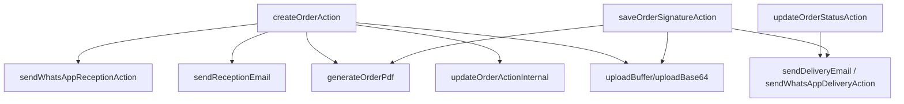

# Casa Tuning — Catálogo técnico de funciones

## 1. Objetivo

Este documento inventaría las funciones relevantes del sistema auditado y define su contrato operativo.

Incluye:

- Route Handlers;
- Server Actions;
- validadores de sesión y seguridad;
- adaptadores de correo, WhatsApp, archivos y PDF;
- funciones privadas que concentran reglas de negocio.

No enumera cada callback visual de React. Los manejadores de botones son detalles de presentación; las funciones que modifican datos o integran proveedores sí forman parte del contrato técnico.

## 2. Clasificación

| Tipo | Definición | Consumidor |
|---|---|---|
| Route Handler | Función HTTP explícita de Next.js. | Auth.js, scheduler o futuro cliente externo. |
| Server Action | Comando interno invocado desde la UI React. | Componentes de Casa Tuning. |
| Función de aplicación | Orquesta reglas y datos sin ser una API pública. | Server Actions y páginas. |
| Adaptador | Traduce el modelo interno al contrato de un proveedor. | Capa de aplicación. |
| Utilidad de dominio | Normaliza, cifra, valida o transforma datos. | Acciones y adaptadores. |

## 3. Convenciones de lectura

| Marca | Significado |
|---|---|
| Pública interna | Exportada, pero solo estable dentro del repositorio. |
| HTTP | Accesible por ruta HTTP explícita. |
| Privada | No exportada; puede cambiar sin afectar consumidores externos. |
| Administrador | Debe ejecutar `verifyAdminSession()`. |
| Usuario | Debe ejecutar `verifySession()`. |

Las firmas documentadas reflejan el código actual. Cuando TypeScript infiere el tipo de retorno, se muestra la forma observable más importante.

## 4. Contrato de resultado recomendado

Las funciones actuales usan variantes de `{ success, error }`. Para nuevas funciones se debe centralizar:

```ts
export type FunctionResult<T = undefined> =
  | { success: true; data: T }
  | {
      success: false;
      error: {
        code: string;
        message: string;
        fields?: Record<string, string[]>;
      };
    };
```

Una función no debe combinar excepciones esperables con errores de validación retornados de forma arbitraria.

---

## 5. Autenticación y sesión

### 5.1 `authenticate`

**Archivo:** `src/modules/auth/actions.ts`

```ts
authenticate(
  prevState: string | undefined,
  formData: FormData
): Promise<string | undefined>
```

| Aspecto | Contrato |
|---|---|
| Tipo | Server Action pública interna. |
| Autorización | No requiere sesión previa. |
| Entradas | `email`, `password`. |
| Validación | Auth.js valida correo y contraseña mínima de seis caracteres; busca usuario activo. |
| Éxito | Crea sesión y redirige a `/dashboard`. |
| Fallo esperado | Devuelve mensaje genérico para credenciales inválidas. |
| Datos | Lee `User` y `Role`; compara bcrypt. |

### 5.2 `logoutAction`

```ts
logoutAction(): Promise<void>
```

Destruye la sesión mediante Auth.js y redirige a `/login`.

### 5.3 Exportaciones Auth.js

**Archivo:** `src/auth.ts`

```ts
auth()
signIn(...)
signOut(...)
GET(request)
POST(request)
```

Son funciones generadas por `NextAuth(...)`. `GET` y `POST` se reexportan desde `/api/auth/[...nextauth]`. No constituyen una API de negocio estable.

### 5.4 `verifySession`

**Archivo:** `src/lib/auth-helpers.ts`

```ts
verifySession(): Promise<{
  id: number;
  name: string;
  email: string;
  roleId: number;
  roleName: string;
}>
```

1. Lee la sesión Auth.js.
2. Redirige a `/login` si no existe ID.
3. Consulta el usuario en PostgreSQL.
4. Comprueba que continúe activo.
5. Devuelve la identidad normalizada.

La función usa `React.cache()` para deduplicar llamadas dentro de una misma renderización del servidor.

### 5.5 `verifyAdminSession`

```ts
verifyAdminSession(): ReturnType<typeof verifySession>
```

Llama `verifySession()` y exige `roleName === "Administrador"`. Si el usuario no cumple, redirige a `/dashboard`.

### 5.6 Criterios de prueba

- Usuario inexistente, inactivo o contraseña incorrecta no inicia sesión.
- Operador autenticado no supera `verifyAdminSession()`.
- El cambio de rol o activación en base se refleja en la siguiente verificación.

---

## 6. Reservas

**Archivo:** `src/app/(authenticated)/reservas/actions.ts`

### 6.1 `parseAndValidateScheduledAt`

```ts
parseAndValidateScheduledAt(
  scheduledAtStr: string
): { date?: Date; error?: string }
```

Función privada que:

1. interpreta fechas locales como `America/Bogota` (`-05:00`);
2. rechaza entradas inválidas;
3. rechaza días anteriores;
4. rechaza domingos;
5. exige lunes–viernes entre 8:30 y 18:30;
6. exige sábado entre 8:00 y 18:30.

### 6.2 `createReservationAction`

```ts
createReservationAction(
  prevState: { success: boolean; error?: string } | null,
  formData: FormData
): Promise<{ success: boolean; error?: string }>
```

| Aspecto | Contrato |
|---|---|
| Permiso | Usuario. |
| Requeridos | Nombre, celular, fecha/hora y al menos un servicio. |
| Opcionales | Correo, vehículo existente, placa, modelo, marca y notas. |
| Transacción | Busca/actualiza/crea cliente; crea reserva y servicios. |
| Estado inicial | `PENDIENTE`. |
| Código actual | `RES-2026-####` mediante conteo. |
| Efecto posterior | Confirmación de WhatsApp con `after()`. |
| Revalidación | `/reservas`, `/dashboard`. |

### 6.3 `updateReservationAction`

```ts
updateReservationAction(
  reservationId: number,
  formData: FormData
): Promise<{ success: boolean; error?: string }>
```

Actualiza fecha, estado, notas y descripción temporal del vehículo. Reemplaza todas las relaciones de servicios dentro de una transacción.

Brecha: el estado llega como texto y no se valida contra una lista cerrada.

### 6.4 `cancelReservationAction`

```ts
cancelReservationAction(
  reservationId: number
): Promise<{ success: boolean; error?: string }>
```

Cambia el estado a `CANCELADA` y revalida `/reservas`.

### 6.5 `sendManualReminderAction`

```ts
sendManualReminderAction(
  reservationId: number
): Promise<{ success: boolean; error?: string }>
```

Invoca el adaptador de recordatorio. Solo informa éxito cuando Kapso acepta el envío y entonces revalida la vista.

### 6.6 `getReservationForReceptionAction`

```ts
getReservationForReceptionAction(
  reservationId: number
): Promise<
  | { success: true; reservation: ReservationWithRelations }
  | { success: false; error: string }
>
```

Devuelve cliente, tipo de documento, vehículo, marca y servicios para precargar la recepción.

### 6.7 Matriz de efectos

| Función | Lee | Escribe | Proveedor externo |
|---|---|---|---|
| Crear | Cliente, contador de reservas | Cliente, reserva, servicios | WhatsApp |
| Actualizar | Reserva | Reserva, servicios | No |
| Cancelar | Reserva | Estado | No |
| Recordar | Reserva completa | Marca de recordatorio | WhatsApp |
| Precargar | Reserva completa | No | No |

---

## 7. Recepción

**Archivo:** `src/app/(authenticated)/recepcion/actions.ts`

### 7.1 `createOrderAction`

```ts
createOrderAction(
  prevState: { success: boolean; error?: string } | null,
  formData: FormData
): Promise<{ success: boolean; error?: string }>
```

Esta es la función principal del ingreso del vehículo.

#### Entradas de cliente

```text
clientName
clientPhone
clientPhone2?
clientEmail?
clientDocumentTypeId?
clientDocumentNumber?
```

#### Entradas de vehículo

```text
plate
year
brandId
model
color
mileage?
vehicleType?
```

#### Entradas de orden

```text
services[]
observations?
serviceDescription?
checklist?
signature?
reservationId?
orderId?
```

#### Decisión de ejecución

```text
Si existe orderId válido
  → editar orden existente
Si no existe
  → crear una nueva recepción
```

#### Validaciones principales

- nombre y celular obligatorios;
- celular de 10 dígitos;
- correo opcional con formato válido;
- placa alfanumérica de 5–6 caracteres;
- marca y año numéricos;
- al menos un servicio;
- correo/documento no asociados a otro teléfono;
- placa activa no asociada a otro cliente.

#### Transacción de creación

1. Busca o crea cliente por teléfono.
2. Cifra y crea índice del documento cuando se proporciona.
3. Busca, actualiza o crea vehículo activo.
4. Busca estado `RECIBIDO`.
5. Genera código de orden.
6. Crea orden.
7. Crea relaciones de servicios.
8. Registra actividad.
9. Marca reserva `ATENDIDA`, si corresponde.

#### Efectos con consistencia eventual

Ejecutados mediante `after()`:

- subir firma;
- subir evidencias del checklist;
- actualizar URLs;
- generar y publicar ficha técnica;
- enviar correo de recepción;
- enviar WhatsApp de recepción.

### 7.2 `updateOrderActionInternal`

```ts
updateOrderActionInternal(
  orderId: number,
  formData: FormData,
  user: SessionUser
): Promise<{ success: boolean; error?: string }>
```

Función privada invocada por `createOrderAction` cuando existe `orderId`.

Reglas:

- la orden debe existir;
- solo se edita en estado `RECIBIDO`;
- actualiza cliente, vehículo, orden y servicios en transacción;
- registra actividad;
- procesa firma/evidencias y regenera PDF posteriormente.

### 7.3 Riesgos funcionales

- Los códigos `CT-2026-####` usan conteo y pueden colisionar.
- Algunos IDs de servicios se convierten con `parseInt`, pero deben validarse todos antes de la transacción.
- El efecto posterior carece de outbox y reintento durable.
- `user` usa `any` en la función interna y debe tiparse.

---

## 8. Órdenes

**Archivo:** `src/app/(authenticated)/ordenes/actions.ts`

### 8.1 `updateOrderStatusAction`

```ts
updateOrderStatusAction(
  orderId: number,
  newStatusName: string
): Promise<{ success: boolean; error?: string }>
```

| Paso | Operación |
|---:|---|
| 1 | Verifica usuario. |
| 2 | Busca orden y estado actual. |
| 3 | Retorna éxito sin mutación si no cambia. |
| 4 | Busca el estado destino por nombre. |
| 5 | Actualiza estado y crea actividad en transacción. |
| 6 | Si queda `ENTREGADO`, decide notificación según firma. |

Brecha: comprueba existencia del destino, pero no valida la transición origen → destino.

### 8.2 `uploadDeliveryPdfAction`

```ts
uploadDeliveryPdfAction(
  formData: FormData
): Promise<{ success: boolean; error?: string }>
```

- Requiere usuario.
- Exige `orderId` y `file`.
- Solo acepta la operación si la orden está `ENTREGADO`.
- Convierte el archivo a `Buffer` y lo publica como PDF en R2.
- Guarda `deliveryPdfUrl` y actividad.
- Si existe firma, puede enviar correo y WhatsApp de entrega.

Brecha: debe validar MIME, contenido PDF y tamaño antes de leer todo el archivo.

### 8.3 `deleteDeliveryPdfAction`

```ts
deleteDeliveryPdfAction(
  orderId: number
): Promise<{ success: boolean; error?: string }>
```

Intenta eliminar el objeto de R2. Aunque el borrado remoto falle, limpia la URL en base y registra la actividad.

### 8.4 `addOrderCommentAction`

```ts
addOrderCommentAction(
  orderId: number,
  content: string
): Promise<{ success: boolean; error?: string }>
```

Rechaza contenido vacío. El servidor solo acepta comentarios en `EN_PROCESO` o `LISTO`. Crea comentario y actividad en la misma transacción.

### 8.5 `downloadOrderPdfAction`

```ts
downloadOrderPdfAction(
  orderId: number
): Promise<
  | { success: true; url: string }
  | { success: false; error: string }
>
```

Genera la ficha técnica, la sube a R2 con caché corta y devuelve su URL.

### 8.6 `saveOrderSignatureAction`

```ts
saveOrderSignatureAction(
  orderId: number,
  signatureData: string
): Promise<{ success: boolean; error?: string }>
```

1. Exige data URL de imagen.
2. Busca orden.
3. Sube firma.
4. Guarda URL y actividad en transacción.
5. Regenera ficha técnica.
6. Si la orden ya está entregada, envía notificaciones de entrega.

### 8.7 Reglas de idempotencia objetivo

| Función | Clave recomendada |
|---|---|
| Cambiar estado | `order:<id>:transition:<from>:<to>` |
| Subir documento | `order:<id>:delivery-document:<sha256>` |
| Añadir comentario | ID generado en cliente o comando. |
| Generar ficha | `order:<id>:technical-sheet:<updatedAt>` |
| Firmar | `order:<id>:signature:<sha256>` |

---

## 9. Clientes

**Archivo:** `src/app/(authenticated)/clientes/actions.ts`

### 9.1 `createClientAction`

```ts
createClientAction(
  prevState: { success: boolean; error?: string } | null,
  formData: FormData
): Promise<{ success: boolean; error?: string }>
```

Administrador. Valida nombre, teléfono, correo y documento; cifra el documento y crea el cliente.

### 9.2 `updateClientAction`

```ts
updateClientAction(
  prevState: { success: boolean; error?: string } | null,
  formData: FormData
): Promise<{ success: boolean; error?: string }>
```

Administrador. Valida colisiones excluyendo el ID actual.

Semántica del documento:

| Entrada | Resultado |
|---|---|
| Nuevo valor | Cifra y reemplaza documento/hash. |
| `********` | Conserva el valor vigente. |
| Vacío | Elimina documento y hash. |

### 9.3 `createCarAction`

```ts
createCarAction(
  prevState: { success: boolean; error?: string } | null,
  formData: FormData
): Promise<{ success: boolean; error?: string }>
```

Administrador. Registra un vehículo desde el detalle de cliente sin crear orden.

### 9.4 `uploadClientPhotoAction`

```ts
uploadClientPhotoAction(
  clientId: number,
  base64Data: string
): Promise<
  | { success: true; photoUrl: string }
  | { success: false; error: string }
>
```

Intenta eliminar la foto anterior, sube la nueva y actualiza `photoUrl`.

---

## 10. Vehículos

**Archivo:** `src/app/(authenticated)/vehiculos/actions.ts`

### 10.1 `createCarAdminAction`

```ts
createCarAdminAction(
  prevState: { success: boolean; error?: string } | null,
  formData: FormData
): Promise<{ success: boolean; error?: string }>
```

Administrador. Exige propietario, placa, año, marca, modelo y color. Bloquea otra placa activa igual y crea el vehículo activo.

### 10.2 `updateCarAdminAction`

```ts
updateCarAdminAction(
  prevState: { success: boolean; error?: string } | null,
  formData: FormData
): Promise<{ success: boolean; error?: string }>
```

Administrador. Actualiza propietario, datos y `isActive`. Solo aplica la validación de placa global cuando el vehículo quedará activo.

### 10.3 Diferencia entre funciones de vehículo

| Función | Contexto |
|---|---|
| `createCarAction` | Alta desde el detalle de Cliente. |
| `createCarAdminAction` | Alta desde el módulo Vehículos. |
| `updateCarAdminAction` | Edición y activación desde Vehículos. |

Las dos altas duplican reglas. Deben converger en un servicio de dominio común.

---

## 11. Administración

**Archivo:** `src/app/(authenticated)/administracion/actions.ts`

### 11.1 Servicios

#### `createServiceAction`

```ts
createServiceAction(prevState, formData)
```

Crea un servicio con nombre único, icono opcional, `isTopSelling` e `isActive`.

#### `updateServiceAction`

```ts
updateServiceAction(prevState, formData)
```

Actualiza los mismos campos y valida nombre duplicado en otro registro.

#### `deleteServiceAction`

```ts
deleteServiceAction(prevState, formData)
```

Bloquea la eliminación si encuentra uso en `OrderService`. También captura conflicto de FK.

Brecha: la comprobación previa no contempla reservas o promociones, aunque las FKs pueden impedir el borrado.

### 11.2 Marcas

#### `createBrandAction`

```ts
createBrandAction(prevState, formData)
```

Valida nombre único, sube logo opcional a R2 y crea la marca.

#### `updateBrandAction`

```ts
updateBrandAction(prevState, formData)
```

Conserva el logo, lo reemplaza si recibe una data URL o lo elimina si recibe cadena vacía.

### 11.3 Usuarios

#### `createUserAction`

```ts
createUserAction(prevState, formData)
```

Valida campos, contraseña mínima, correo único y rol. Genera hash bcrypt, crea usuario activo y envía correo de bienvenida.

Brecha crítica: entrega la contraseña en texto claro al adaptador de correo. Debe sustituirse por invitación de un solo uso.

### 11.4 Diagnóstico de WhatsApp

#### `sendTestSoundTemplateAction`

```ts
sendTestSoundTemplateAction(prevState, formData)
```

Normaliza un teléfono colombiano, crea el payload `prueba_de_sonido_2` y lo envía directamente a Kapso.

---

## 12. Promociones

**Archivo:** `src/app/(authenticated)/promociones/actions.ts`

### 12.1 `getPresignedUploadUrlAction`

```ts
getPresignedUploadUrlAction(
  filename: string,
  contentType: string
): Promise<
  | { success: true; uploadUrl: string; fileUrl: string }
  | { success: false; error: string }
>
```

Administrador. Genera la clave `promotions/<timestamp>-<slug>` y delega en R2.

### 12.2 `getWhatsAppTemplatesAction`

```ts
getWhatsAppTemplatesAction(): Promise<
  | { success: true; templates: unknown[] }
  | { success: false; error: string }
>
```

Administrador. Consulta hasta 100 plantillas del WABA y conserva solo estado `APPROVED`.

### 12.3 `createPromotionAction`

```ts
createPromotionAction(
  prevState: { success: boolean; error?: string } | null,
  formData: FormData
): Promise<{ success: boolean; error?: string }>
```

Requiere nombre, servicio, marca, plantilla y JSON con al menos un cliente. Crea `Promotion` e inicia el envío.

### 12.4 `dispatchPromotionMessages`

```ts
dispatchPromotionMessages(
  promotionId: number,
  clientIds: number[]
): Promise<void>
```

Función privada que:

1. recorre destinatarios secuencialmente;
2. invoca WhatsApp;
3. registra `SENT` o `FAILED`;
4. espera 200 ms entre destinatarios.

No es un worker durable. Puede interrumpirse si el runtime finaliza la solicitud.

---

## 13. Correo electrónico

**Archivo:** `src/lib/emails.ts`

### 13.1 `sendWelcomeEmail`

```ts
sendWelcomeEmail(
  toEmail: string,
  userName: string,
  roleName: string,
  password: string,
  userId: number
): Promise<{ success: boolean; id?: string; error?: string }>
```

Clave de idempotencia: `welcome-email/<userId>`.

### 13.2 `sendReceptionEmail`

```ts
sendReceptionEmail(
  toEmail: string,
  order: OrderEmailData
): Promise<{ success: boolean; id?: string; error?: string }>
```

Clave: `reception-email-<orderId>`. Construye el correo con datos técnicos de recepción.

### 13.3 `sendDeliveryEmail`

```ts
sendDeliveryEmail(
  toEmail: string,
  order: OrderEmailData
): Promise<{ success: boolean; id?: string; error?: string }>
```

Genera ficha técnica, la publica en R2, la adjunta si fue posible y envía el mensaje con clave `delivery-email-<orderId>`.

### 13.4 `sendReadyEmail`

```ts
sendReadyEmail(
  toEmail: string,
  order: OrderEmailData
): Promise<{ success: boolean; id?: string; error?: string }>
```

Clave: `ready-email-<orderId>`. Existe, pero no se invoca en el flujo auditado.

### 13.5 Comportamiento común

Si falta una API key real, las funciones registran advertencia y devuelven fallo sin lanzar sobre el flujo principal.

---

## 14. WhatsApp

**Archivo:** `src/lib/whatsapp.ts`

### 14.1 `obtenerRecomendaciones`

```ts
obtenerRecomendaciones(
  servicios: { name: string }[]
): { serviceName: string; instructions: string } | null
```

Busca palabras clave de polarizado/película, PPF y radio/Android/pantalla. Deduplica instrucciones y devuelve `null` si no encuentra recomendaciones.

### 14.2 `formatearTelefono`

```ts
formatearTelefono(phone: string): string
```

Función privada. Si recibe 10 dígitos, antepone `+57`; en otro caso antepone `+` a los dígitos disponibles.

### 14.3 `enviarMensajeKapso`

```ts
enviarMensajeKapso(payload: unknown): Promise<boolean>
```

Función privada común. Configura endpoint, headers, serialización, manejo de error HTTP/red y resultado booleano.

### 14.4 Funciones de orden

| Función | Plantilla/tipo | Registro exitoso |
|---|---|---|
| `sendWhatsAppReceptionAction(orderId)` | `vehiculo_recibido` | `RECEPCION` |
| `sendWhatsAppDeliveryAction(orderId)` | `vehiculo_entregado` | `ENTREGA` |
| misma función de entrega | `recomendaciones_servicio` | `RECOMENDACIONES` |
| `sendWhatsAppReadyAction(orderId)` | Texto libre | `VEHICULO_LISTO` |

Todas devuelven `Promise<boolean>`.

### 14.5 Función de campaña

```ts
sendWhatsAppPromotionAction(
  promotionId: number,
  clientId: number
): Promise<boolean>
```

Obtiene campaña/cliente, mapea nombre–servicio–marca, detecta el tipo de archivo por extensión y envía la plantilla elegida.

### 14.6 Funciones de reserva

```ts
sendWhatsAppReservationConfirmationAction(
  reservationId: number
): Promise<boolean>

sendWhatsAppReservationReminderAction(
  reservationId: number
): Promise<boolean>
```

La confirmación usa `reserva_confirmada_2`. El recordatorio usa `recordatorio_cita_2` y, si tiene éxito, actualiza `reminderSent` y `reminderSentAt`.

### 14.7 Función de formato de fecha

```ts
formatearFechaHoraReserva(date: Date): string
```

Privada. Formatea en español de Colombia y zona `America/Bogota`.

---

## 15. Almacenamiento

**Archivo:** `src/lib/storage.ts`

### 15.1 `uploadBuffer`

```ts
uploadBuffer(
  buffer: Buffer,
  key: string,
  contentType: string,
  cacheControl?: string
): Promise<string>
```

Sube un objeto al bucket y devuelve URL pública. El caché por defecto es un año e inmutable.

### 15.2 `uploadBase64`

```ts
uploadBase64(
  base64Str: string,
  key: string
): Promise<string>
```

Acepta data URL o Base64 crudo, detecta MIME/extensión y delega en `uploadBuffer`.

### 15.3 `deleteFile`

```ts
deleteFile(urlOrKey: string): Promise<void>
```

Extrae la clave desde una URL o usa la clave directa y elimina el objeto.

### 15.4 `getPresignedUploadUrl`

```ts
getPresignedUploadUrl(
  key: string,
  contentType: string,
  expiresIn?: number
): Promise<{ uploadUrl: string; fileUrl: string }>
```

Genera una URL `PUT` prefirmada. Expira en 3.600 segundos por defecto.

### 15.5 Helpers privados

| Función | Responsabilidad |
|---|---|
| `getClient` | Validar configuración e inicializar S3Client una vez. |
| `parseBase64` | Separar MIME y bytes. |
| `getExtensionFromMimeType` | Mapear MIME a extensión permitida. |
| `pathHasExtension` | Detectar extensión en la clave. |
| `getKeyFromUrlOrKey` | Resolver URL pública a clave R2. |

---

## 16. Seguridad de documentos

**Archivo:** `src/lib/security.ts`

### 16.1 `normalizeDocument`

```ts
normalizeDocument(docNumber: string): string
```

Elimina caracteres no alfanuméricos y convierte a minúsculas.

### 16.2 `hashDocument`

```ts
hashDocument(docNumber: string): string
```

Genera SHA-256 hexadecimal sobre el documento normalizado. Se usa como índice ciego de unicidad.

### 16.3 `isHashed`

```ts
isHashed(value: string): boolean
```

Comprueba formato hexadecimal de 64 caracteres. No demuestra que el valor sea un hash confiable.

### 16.4 `encryptDocument`

```ts
encryptDocument(docNumber: string): string
```

Exige `ENCRYPTION_KEY` de 32 caracteres, crea IV aleatorio y cifra con AES-256-CBC. Devuelve `<iv>:<ciphertext>` hexadecimal.

### 16.5 `decryptDocument`

```ts
decryptDocument(encryptedData: string): string
```

Descifra el formato anterior. Si no contiene `:`, devuelve el texto como compatibilidad heredada. En un error criptográfico devuelve `[Error Cifrado]`.

### 16.6 Evolución requerida

- AES-GCM autenticado.
- HMAC para el índice ciego.
- versión de ciphertext y `keyId`.
- eliminación futura del fallback de texto claro.

---

## 17. Generación de PDF

**Archivo:** `src/lib/pdf-generator.ts`

### 17.1 `generateOrderPdf`

```ts
generateOrderPdf(orderId: number): Promise<Buffer>
```

Consulta la orden y genera una ficha tamaño carta.

Incluye cuando existen:

- código y fecha;
- cliente y vehículo;
- servicios;
- descripción;
- checklist;
- observaciones;
- evidencias;
- comentarios y autores;
- firma.

Lanza error si la orden no existe o si PDFKit no puede completar el documento.

### 17.2 Helpers privados

| Función | Responsabilidad |
|---|---|
| `fetchImageBuffer` | Descargar imagen remota para incrustarla. |
| `formatDate` | Formatear fecha del documento. |

Debe añadirse timeout y límite de tamaño a la descarga de imágenes.

---

## 18. Cron de recordatorios

**Archivo:** `src/app/api/cron/reminders/route.ts`

### 18.1 `GET`

```ts
GET(request: Request): Promise<NextResponse>
```

| Aspecto | Contrato actual |
|---|---|
| Transporte | HTTP GET. |
| Autenticación | Query `key` o Bearer; se exige solo en producción. |
| Selección | Reserva `PENDIENTE`, no recordada, entre ahora y 24 horas. |
| Procesamiento | Secuencial. |
| Éxito | JSON con timestamp, encontradas y enviadas. |
| Error | `401` o `500`. |

Estado objetivo: Bearer obligatorio en staging/producción, sin secreto por defecto, lock de concurrencia e idempotencia.

### 18.2 Entradas de renderizado

Las funciones `page.tsx`, layouts y estados de carga son puntos de entrada del App Router. Leen y componen datos, pero no deben concentrar mutaciones.

| Función | Ruta o responsabilidad |
|---|---|
| `RootLayout` | Layout raíz, metadatos y estructura HTML. |
| `RootLoading` | Estado de carga global. |
| `Home` | Redirige a Dashboard o Login según sesión. |
| `LoginPage` | Renderiza autenticación. |
| `PublicPoliticasPrivacidadPage` | Página pública de políticas y términos. |
| `AuthenticatedLayout` | Verifica sesión y monta navegación/toasts. |
| `AuthenticatedLoading` | Estado de carga del área privada. |
| `DashboardPage` | Calcula indicadores y actividad. |
| `ReservasPage` | Carga reservas, clientes, marcas y servicios. |
| `RecepcionPage` | Carga catálogos y precarga orden/reserva. |
| `OrdenesPage` | Carga órdenes y relaciones. |
| `ClientesPage` | Carga CRM; exige Administrador. |
| `VehiculosPage` | Carga vehículos; exige Administrador. |
| `PromocionesPage` | Carga campañas y segmentación; exige Administrador. |
| `AdministracionPage` | Carga catálogos y usuarios; exige Administrador. |

`proxy` y `authConfig` participan en el enrutamiento de sesión. Las páginas y Server Actions conservan las guardas definitivas.

---

## 19. Funciones de presentación por capacidad

Los componentes React implementan estas funciones visibles:

| Componente | Funciones de usuario |
|---|---|
| `Sidebar` | Navegar por rol, abrir/cerrar menú móvil, cerrar sesión. |
| `DashboardFAB` | Abrir Nueva recepción. |
| `ReservasClientView` | Buscar, filtrar, editar, cancelar, recordar y convertir reserva. |
| `ReservaFormModal` | Capturar cliente, vehículo, fecha, servicios y notas. |
| `RecepcionForm` | Buscar/crear cliente y vehículo, capturar checklist, evidencia y firma. |
| `OrdenesClientView` | Buscar, filtrar, cambiar estado, comentar, firmar y gestionar PDFs. |
| `ClientesClientView` | Buscar, crear/editar cliente, ver historial y añadir vehículo/foto. |
| `VehiculosClientView` | Buscar, crear, editar y activar/desactivar vehículo. |
| `PromocionesClientView` | Crear campaña, segmentar, subir archivo y consultar resultados. |
| `AdministracionClientView` | Gestionar servicios, marcas, usuarios y prueba de WhatsApp. |
| `ToastProvider` | Mostrar retroalimentación efímera de éxito/error. |
| `useToast` | Acceder a la función de notificación desde componentes descendientes. |
| `PageTransition` | Aplicar la transición visual al cambiar de vista. |

El servidor sigue siendo la autoridad de permisos y reglas.

## 20. Funciones duplicadas o dispersas

| Regla | Ubicaciones | Refactor recomendado |
|---|---|---|
| Normalización de teléfono | Recepción, clientes, reservas, vehículos, WhatsApp | `PhoneNumber` y parser común. |
| Normalización/validación de placa | Recepción, clientes, vehículos | `VehiclePlate` común. |
| Alta de vehículo | Clientes, Vehículos, Recepción | Servicio `registerVehicle`. |
| Validación de correo | Clientes y Recepción | Esquema compartido. |
| Código correlativo | Recepción y Reservas | Generador transaccional. |
| Resultados `{success,error}` | Todas las acciones | `FunctionResult<T>`. |
| Notificaciones de entrega | Estado, firma y PDF | Orquestador idempotente de entrega. |

## 21. Dependencias entre funciones críticas



## 22. Plantilla para documentar funciones futuras

````markdown
### `functionName`

**Responsabilidad:** una sola frase.

**Firma:**

```ts
functionName(input: Input): Promise<FunctionResult<Output>>
```

**Permiso:** Usuario / Administrador / Máquina.

**Precondiciones:**

- condición verificable;

**Transacción:** datos que cambian atómicamente.

**Efectos externos:** proveedor, idempotency key y política de reintento.

**Errores:** códigos cerrados.

**Postcondiciones:** estado observable después del éxito.

**Pruebas:** casos felices, bordes, permisos, concurrencia y fallos externos.
````

## 23. Definition of Done para una función

- [ ] Responsabilidad única.
- [ ] Firma sin `any` evitable.
- [ ] Entrada validada en el límite.
- [ ] Autorización aplicada dentro de la función.
- [ ] Invariantes ejecutadas en servidor.
- [ ] Transacción delimitada.
- [ ] Efectos externos idempotentes.
- [ ] Errores con códigos estables.
- [ ] Logs sin secretos ni PII.
- [ ] Pruebas de éxito, rechazo y concurrencia.
- [ ] Catálogo y documentación de módulo actualizados.
